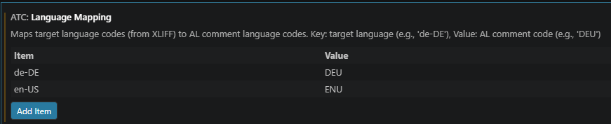

 

# Introduction

AL Translation Cleaner is a VS Code extension that automatically inserts missing translations from XLIFF files as code comments into your AL files. It helps Business Central developers to quickly and accurately comment, fix and review their multilingual extensions.

## Features

#### ATC: Write Translations to Comments in current AL File

Finds all translations for the selected AL file and adds missing translations if needed.

#### ATC: Write Translations in current Xliff File to AL File Comments

Finds all translations in the XLIFF file and writes all missing translations for that language into the corresponding files.

#### ATC: Write Translations from All Xliff Files to AL File Comments

Finds all translations in all the XLIFF files and writes all missing translations into the corresponding files.

## Extension Settings

- `ATC.translationMethod` - Specifies the method of XLIFF editing used. Replace mode completely overwrites all translations with the translations from XLIFF files. Add mode only adds missing translations and does not modify existing translations. Ask mode adds missing translations and asks how to handle conflicting existing translations.
- `ATC.languageMapping` - Maps target language codes (from XLIFF) to AL comment language codes. Key: target language (e.g., 'de-DE'), Value: AL comment code (e.g., 'DEU')

  
- `ATC.WhenTranslationNotFound` - Specifies the action to take when a translation is not found. Options are: log the missing translation, ask the user, or delete the missing translation from the xliff file.

## Contribute

You are always welcome to open an issue for enhancements and bugs [here](https://github.com/BiTeamGit/Al-Translation-Cleaner/issues/new).
